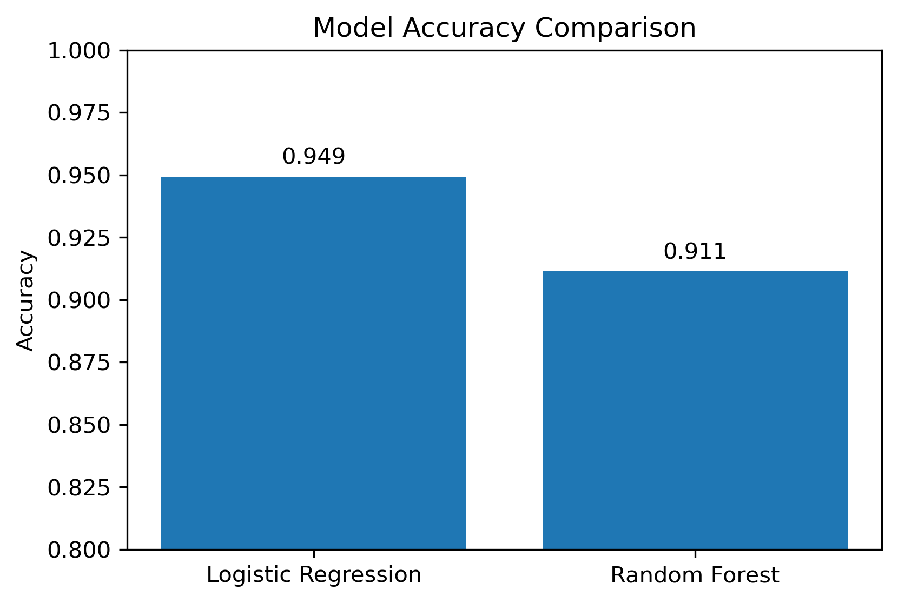
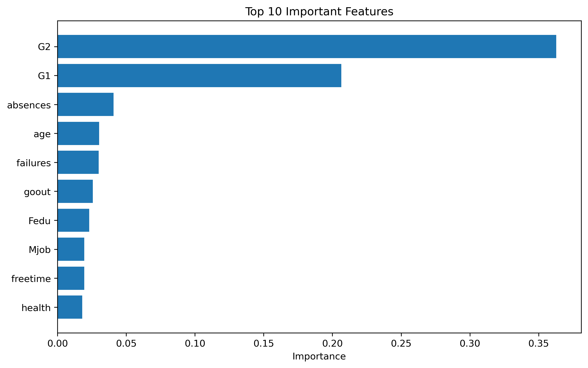

# 🎓 Student Performance Prediction Using Machine Learning

## 👤 Author
**Aamna Syed**

## 📌 Project Description
This project predicts whether a student will pass or fail based on demographic, academic, and behavioral features using machine learning classification models.

## 🛠 Skills Demonstrated

- Data Cleaning
- Exploratory Data Analysis (EDA)
- Feature Engineering
- Machine Learning
- Model Evaluation
- Data Visualization

## 🛠️ Programming Language
- Python 3

## 📚 Required Libraries
- pandas
- numpy
- matplotlib
- scikit-learn

## 📂 Dataset
- student-mat.csv

## 🤖 Machine Learning Models
- Logistic Regression
- Random Forest Classifier

## 📊 Evaluation Metrics
- Accuracy
- Precision
- Recall
- F1 Score
- Confusion Matrix

## 🚀 How to Run the Project

1. Open Jupyter Notebook.
2. Open `student_performance_prediction.ipynb`.
3. Make sure `student-mat.csv` is in the same folder as the notebook.
4. Install the required libraries if needed:
   ```bash
   pip install pandas numpy matplotlib scikit-learn
   ```
5. Run all notebook cells from top to bottom.
6. The notebook will generate the evaluation results and visualizations automatically.

## 📈 Project Outputs
## 📈 Results

- Logistic Regression achieved **94.9% accuracy**, making it the best-performing model.
- Random Forest achieved **91.1% accuracy**.
- The most influential features were **G2**, **G1**, and **absences**.

### Accuracy Comparison


### Feature Importance

